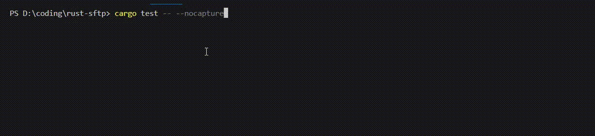

# SSH2 SFTP File Downloader - Sample Code

This repository contains a sample Rust code for downloading files via SSH2 SFTP, using Docker for environment setup.



## Prerequisites

- **Docker** and **Docker Compose**
- **Rust** programming language
- **Libssh** or **OpenSSH** installed

## Setup and Testing

1. **Prepare Test File**:  
   Place a file in the `storage` directory to simulate a file available for download.

2. **Start SFTP Server**:  
   Use Docker Compose to start the SFTP server:
   ```sh
   docker-compose up
   ```

3. **Run Tests**:  
   Clean the project and run the tests with cargo:
   ```sh
   cargo clean
   cargo test -- --nocapture
   ```

4. **Verify Download**:  
   Check the `storage/download` directory for the downloaded file:
   ```sh
   cd storage/download
   ls
   ```